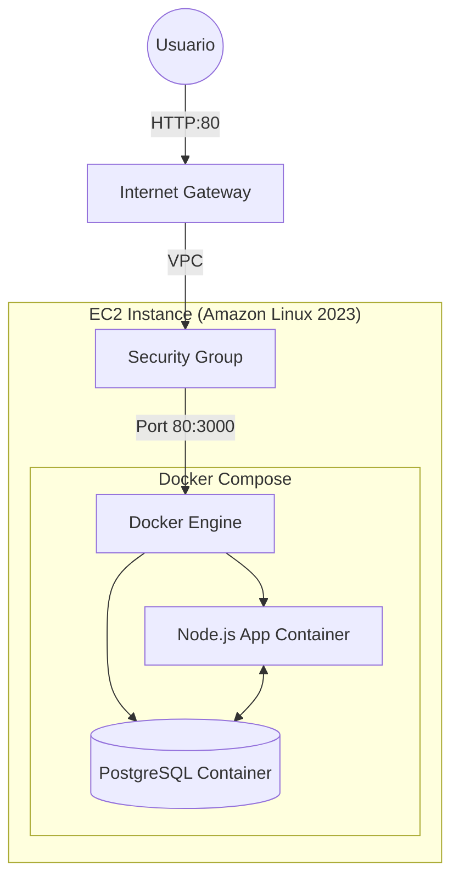

# CloudStock Pro - CloudSolutions SPA


## Descripción
CloudStock Pro es una solución integral de gestión de inventario diseñada para **CloudSolutions SPA**. La aplicación permite realizar operaciones CRUD (Crear, Leer, Actualizar, Borrar) sobre activos de infraestructura cloud, con una interfaz moderna y despliegue automatizado mediante contenedores.

## Arquitectura de la Solución (AWS)



### Componentes:
- **Compute**: AWS EC2 (t3.micro recomendado).
- **Runtime**: Docker & Docker Compose.
- **Backend**: Node.js v20 (Express).
- **Database**: PostgreSQL 15 (Persistencia mediante volúmenes Docker).
- **Security**: Security Groups restringiendo tráfico al puerto 80 (App) y 22 (SSH).

## Requisitos Previos
- Docker & Docker Compose instalados.
- Instancia AWS EC2 con Amazon Linux o Ubuntu.

## Despliegue Rápido

1. **Clonar el repositorio:**
   ```bash
   git clone https://github.com/tu-usuario/cloudstock-pro.git
   cd cloudstock-pro
   ```

2. **Levantar la infraestructura:**
   ```bash
   docker-compose up -d
   ```

3. **Acceder a la aplicación:**
   Abre tu navegador en `http://tu-ip-publica-aws`

## Estructura del Proyecto
```text
├── app/
│   ├── public/         # Frontend (HTML, CSS, JS)
│   ├── package.json    # Dependencias Node.js
│   └── server.js       # API Backend
├── Dockerfile          # Configuración de imagen (Non-root user)
├── docker-compose.yml  # Orquestación de servicios
└── README.md           # Documentación principal
```

## Seguridad Implementada
- **Non-root user**: El contenedor de la aplicación corre bajo un usuario sin privilegios.
- **Environment Variables**: Gestión de credenciales fuera del código.
- **Security Groups**: Aislamiento de red recomendado en AWS.
