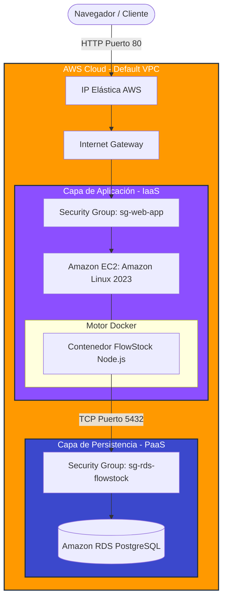

# FlowStock - B2B Cloud Inventory Management 📦☁️


FlowStock es una plataforma web B2B diseñada para la gestión centralizada de inventarios de recursos (diseño, edición, activos digitales). Este proyecto implementa una arquitectura cloud nativa, desacoplada y escalable, diseñada bajo los principios del **AWS Well-Architected Framework**.

---

## 🏗️ Arquitectura de la Solución

El sistema sigue una **Arquitectura de Dos Capas (Two-Tier)**, separando el cómputo (Aplicación) del estado (Base de Datos) para garantizar la inmutabilidad de los servidores y la continuidad operativa.

### Diagrama de Infraestructura AWS



### Componentes de la Arquitectura

| Componente | Servicio AWS | Descripción |
|---|---|---|
| **Cómputo** | Amazon EC2 (t3.micro) | Instancia Amazon Linux 2023 que actúa como Docker Host |
| **Contenedor** | Docker & Docker Compose | Empaquetado y orquestación de la aplicación Node.js |
| **Backend** | Node.js / Express.js | API REST que gestiona la lógica de negocio |
| **Base de Datos** | Amazon RDS (PostgreSQL) | Capa de persistencia gestionada, sin IP pública |
| **Red** | VPC, Internet Gateway, Elastic IP | Routing y conectividad pública hacia la instancia |

---

## 🔐 Seguridad Implementada

- **Security Group Nesting:** La base de datos RDS no posee IP pública. Solo acepta tráfico originado desde el ID del Security Group de la instancia EC2, aislando los datos de la internet pública.
- **Inmutabilidad:** Las variables sensibles no existen en este repositorio. Se inyectan en tiempo de ejecución a través de un archivo `.env` en el servidor host.
- **Non-root Container:** El contenedor de la aplicación corre bajo un usuario sin privilegios (`node`), reduciendo la superficie de ataque.
- **Validación de Entradas:** El backend aplica sanitización y validación de datos en todos los endpoints de la API.

---

## 🚀 Guía de Despliegue en AWS

> Las siguientes instrucciones asumen que ya posees una instancia **Amazon EC2** (Amazon Linux 2023) y una base de datos **Amazon RDS** (PostgreSQL) provisionadas.

### 1. Preparación del Servidor (Host)

Conéctate vía SSH a la instancia EC2 y ejecuta los siguientes comandos para preparar el entorno, instalar Docker y configurar memoria Swap (recomendado para instancias `t3.micro`):

```bash
# 1. Actualizar el sistema
sudo dnf update -y

# 2. Configurar 2GB de Memoria Swap (para prevenir Out Of Memory al compilar)
sudo dd if=/dev/zero of=/swapfile bs=128M count=16
sudo chmod 600 /swapfile
sudo mkswap /swapfile
sudo swapon /swapfile

# 3. Instalar Docker y Git
sudo dnf install docker git -y
sudo systemctl start docker
sudo systemctl enable docker
sudo usermod -a -G docker ec2-user

# 4. Instalar Docker Buildx y Docker Compose
sudo mkdir -p /usr/libexec/docker/cli-plugins
sudo curl -L https://github.com/docker/buildx/releases/download/v0.17.1/buildx-v0.17.1.linux-amd64 \
    -o /usr/libexec/docker/cli-plugins/docker-buildx
sudo chmod +x /usr/libexec/docker/cli-plugins/docker-buildx

sudo curl -L "https://github.com/docker/compose/releases/latest/download/docker-compose-$(uname -s)-$(uname -m)" \
    -o /usr/local/bin/docker-compose
sudo chmod +x /usr/local/bin/docker-compose
```

> **Nota:** Después de este paso es necesario **reiniciar la sesión SSH** para aplicar los permisos del grupo `docker`.

---

### 2. Clonación y Configuración

Clona este repositorio en el servidor host:

```bash
git clone https://github.com/bastiovalleipvg/FlowStock.git
cd FlowStock
```

Crea el archivo `.env` para conectar la aplicación con Amazon RDS:

```bash
nano .env
```

Añade las siguientes variables con tus credenciales de AWS:

```env
PORT=3000
DB_HOST=tu-endpoint-rds.amazonaws.com
DB_USER=usuario_bd
DB_PASSWORD=password_seguro
DB_NAME=nombre_bd
DB_PORT=5432
```

---

### 3. Despliegue de la Aplicación

Construye la imagen Docker y levanta el servicio en segundo plano:

```bash
docker-compose up -d --build
```

---

### 4. Verificación

Verifica los logs para asegurar que la conexión a la base de datos fue exitosa:

```bash
docker-compose logs -f app
```

Si el log indica `✅ Base de datos inicializada correctamente`, la aplicación ya está disponible introduciendo la **IP Elástica** del servidor en cualquier navegador web.

---

## 📁 Estructura del Proyecto

```text
FlowStock/
├── app/
│   ├── public/         # Frontend (HTML, CSS, JS)
│   ├── package.json    # Dependencias Node.js
│   └── server.js       # API Backend (Express)
├── Dockerfile          # Configuración de imagen (Non-root user)
├── docker-compose.yml  # Orquestación de servicios
├── .env.example        # Plantilla de variables de entorno
└── README.md           # Documentación principal
```

---

## 🛠️ Tecnologías

| Categoría | Tecnología |
|---|---|
| **Backend** | Node.js, Express.js |
| **Base de Datos** | PostgreSQL (Amazon RDS) |
| **Infraestructura Cloud** | AWS EC2, RDS, VPC, Elastic IP |
| **DevOps** | Docker, Docker Compose, Git |

---

> Proyecto desarrollado para la evaluación práctica de **Cloud Computing - 2026**.
