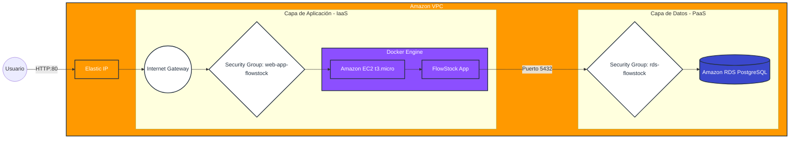

# FlowStock - B2B Cloud 📦☁️


---

## 📖 Descripción General

**FlowStock** es una plataforma web B2B diseñada para la gestión centralizada de inventarios de recursos creativos, incluyendo activos de diseño, edición y contenido digital.

El proyecto implementa una arquitectura **Cloud Native**, desacoplada y altamente disponible, construida bajo principios del **AWS Well-Architected Framework**, priorizando:

- Escalabilidad
- Resiliencia
- Seguridad
- Portabilidad
- Separación de responsabilidades

---

# 🏗️ Arquitectura de la Solución

El sistema utiliza una arquitectura **Two-Tier (Dos Capas)**, separando la lógica de aplicación del almacenamiento persistente de datos.

Esto permite:

- Aplicaciones inmutables
- Mejor tolerancia a fallos
- Escalabilidad independiente
- Menor acoplamiento entre servicios

---

## ☁️ Diagrama de Infraestructura AWS



---

# 🧩 Componentes de la Arquitectura

| Componente | Servicio AWS | Descripción |
|---|---|---|
| Cómputo | Amazon EC2 (t3.micro) | Servidor host basado en Amazon Linux 2023 |
| Contenedores | Docker & Docker Compose | Empaquetado y orquestación de la aplicación |
| Persistencia | Amazon RDS PostgreSQL | Base de datos administrada con backups automáticos |
| Red | VPC + Elastic IP | Infraestructura de red privada con acceso público controlado |
| Seguridad | Security Groups | Filtrado de tráfico y aislamiento de capas |

---

# 🔐 Seguridad e Integridad

## Security Groups Anidados

La base de datos no expone acceso público.

El grupo de seguridad `rds-flowstock` solo permite conexiones provenientes del grupo `web-app-flowstock`.

---

## Cifrado en Tránsito

La aplicación Node.js establece conexión segura mediante SSL/TLS hacia Amazon RDS.

---

## Gestión de Secretos

Las credenciales sensibles se almacenan utilizando archivos `.env` locales dentro de la instancia EC2, evitando exposición en GitHub o sistemas de control de versiones.

---

## Aislamiento de Procesos

La aplicación se ejecuta dentro de un contenedor Docker aislado del sistema operativo host.

---

# 🚀 Guía de Despliegue

## 1️⃣ Preparación del Host EC2

### Actualizar sistema e instalar dependencias

```bash
sudo dnf update -y
sudo dnf install docker git -y
```

---

### Configurar memoria SWAP (2 GB)

> Recomendado para instancias t3.micro debido a limitaciones de RAM.

```bash
sudo dd if=/dev/zero of=/swapfile bs=128M count=16
sudo chmod 600 /swapfile
sudo mkswap /swapfile
sudo swapon /swapfile
```

---

### Habilitar Docker

```bash
sudo systemctl start docker
sudo systemctl enable docker
sudo usermod -a -G docker ec2-user
```

---

### Instalar Docker Buildx

```bash
sudo mkdir -p /usr/libexec/docker/cli-plugins

sudo curl -L \
https://github.com/docker/buildx/releases/download/v0.17.1/buildx-v0.17.1.linux-amd64 \
-o /usr/libexec/docker/cli-plugins/docker-buildx

sudo chmod +x /usr/libexec/docker/cli-plugins/docker-buildx
```

---

### Instalar Docker Compose

```bash
sudo curl -L \
"https://github.com/docker/compose/releases/latest/download/docker-compose-$(uname -s)-$(uname -m)" \
-o /usr/local/bin/docker-compose

sudo chmod +x /usr/local/bin/docker-compose
```

---

# 2️⃣ Despliegue de la Aplicación

## Clonar repositorio

```bash
git clone https://github.com/bastiovalleipvg/FlowStock.git
cd FlowStock
```

---

## Configurar variables de entorno

```bash
nano .env
```

Ejemplo:

```env
DB_HOST=flowstock-db.xxxxxx.us-east-1.rds.amazonaws.com
DB_PORT=5432
DB_NAME=flowstock
DB_USER=admin
DB_PASSWORD=supersecretpassword
```

---

## Construir y levantar contenedores

```bash
docker-compose up -d --build
```

---

# 📁 Estructura del Proyecto

```plaintext
FlowStock/
├── app/
│   ├── public/              # Frontend HTML/CSS/JS
│   ├── package.json         # Dependencias Node.js
│   └── server.js            # Servidor Express y lógica backend
│
├── Dockerfile               # Imagen Docker de la aplicación
├── docker-compose.yml       # Orquestación de servicios
└── README.md                # Documentación técnica
```

---

# 🛠️ Stack Tecnológico

| Categoría | Tecnología |
|---|---|
| Backend | Node.js + Express |
| Frontend | HTML5, CSS3, JavaScript |
| Base de Datos | PostgreSQL |
| Cloud | AWS EC2, AWS RDS, AWS VPC |
| Contenedores | Docker & Docker Compose |
| DevOps | Linux Administration, Git |

---

# 📊 Principios Cloud Implementados

- Arquitectura desacoplada
- Persistencia administrada
- Infraestructura escalable
- Contenedorización
- Infraestructura reproducible
- Seguridad basada en mínimo privilegio
- Gestión centralizada de red

---

# 🎯 Objetivo del Proyecto

FlowStock fue desarrollado como solución de gestión centralizada de inventario digital para entornos creativos y empresariales.

El proyecto demuestra competencias en:

- Cloud Computing
- DevOps
- Infraestructura AWS
- Dockerización
- Arquitectura distribuida
- Administración Linux
- Seguridad cloud

---

# 👨‍💻 Autor

**Basti Ovalles**  
Ingeniería en Informática — Cloud Computing 2026

---
